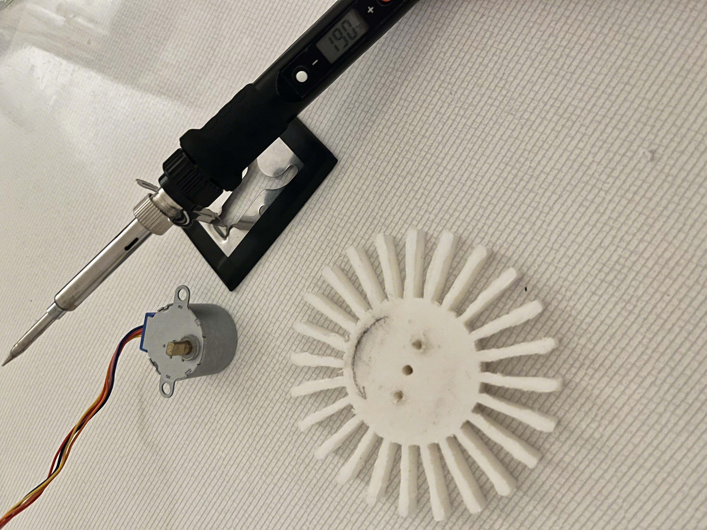

1. I designed rotary slots for the fish foods
2. I used wood burning tool to make just big enough holes for the servo motor to get mounted on.

3. But I learned my lesson, that servo motor doesn't continueosly spin..
4. so I swapped it out with a stepper motor, and I was happy to do so thinking that stepper motor being more accurate, it would make things easier.

5. BUT my stepper motor was too cheap and poorly made that it was very inconsistent. and I also learned that stepper motor gets VERY HOT even when it's not moving. (Cause it's trying to hold it's position or something..)
6. so next time, I think I'll just have to use a DC motor with a sensor of some sort to spin just the right amount.
